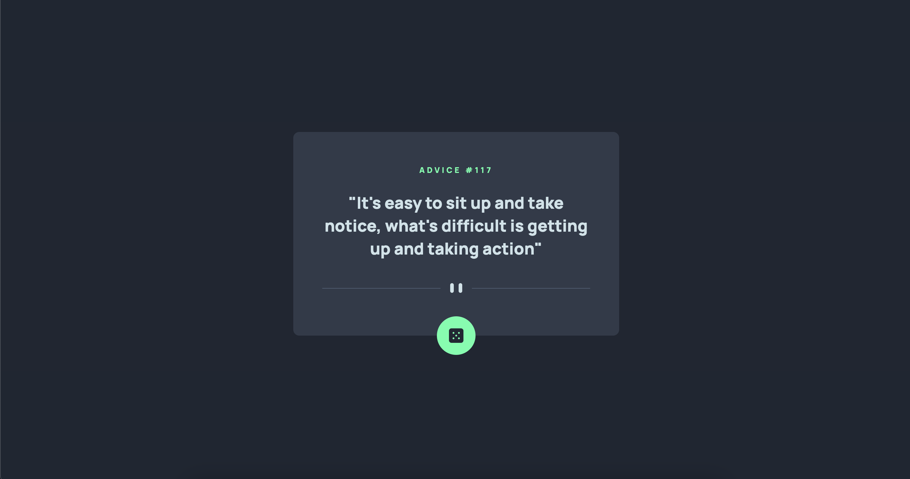

# Frontend Mentor - Advice generator app solution

This is a solution to the [Advice generator app challenge on Frontend Mentor](https://www.frontendmentor.io/challenges/advice-generator-app-QdUG-13db). Frontend Mentor challenges help you improve your coding skills by building realistic projects.

## Table of contents

- [Overview](#overview)
  - [The challenge](#the-challenge)
  - [Screenshot](#screenshot)
  - [Links](#links)
- [My process](#my-process)
  - [Built with](#built-with)
  - [What I learned](#what-i-learned)
  - [Continued development](#continued-development)
  - [Useful resources](#useful-resources)
- [Author](#author)


## Overview

### The challenge

Users should be able to:

- View the optimal layout for the app depending on their device's screen size
- See hover states for all interactive elements on the page
- Generate a new piece of advice by clicking the dice icon

### Screenshot

Desktop view


Mobile view


### Links

- Solution URL: [Add solution URL here](https://www.frontendmentor.io/solutions/advice-generator-app-solutionwith-pure-html-css-and-javascript-dz-baVyokh)
- Live Site URL: [Add live site URL here](https://francinehuang.github.io/advice-generator-app/)

## My process

### Built with

- HTML, CSS and JavaScript


### What I learned

I learned how to connect the api with using pure javascript
```js
const url = "https://api.adviceslip.com/advice"
const button = document.getElementById("advice-card-btn")

button.addEventListener("click", (event) => {
    fetch(url)
    .then((response) => {
        if (!response.ok) {
            throw new Error(`Response status: ${response.status}`);
        }
        return response.json()
    })
    .then((adviceSwitch) => {
        console.log(adviceSwitch.slip.id)
        console.log(adviceSwitch.slip.advice)

        const adviceTitle = document.getElementById("advice-card-title")
        adviceTitle.textContent = "Advice # " + adviceSwitch.slip.id

        const adviceText = document.getElementById("advice-card-text")
        adviceText.textContent = "\u{201C}" + adviceSwitch.slip.advice + "\u{201D}"
    })
})
```

### Continued development

- Try to make another solution by using React.
- Write catch error case base on the script.

### Useful resources

- [Using the Fetch API](https://developer.mozilla.org/en-US/docs/Web/API/Fetch_API/Using_Fetch) - This document from MDN really helps me alot. It makes me to understand the basic concept of fetching api.
- [PX to REM converter](https://nekocalc.com/px-to-rem-converter) - I use this simple tool to convert px and rem.

## Author

- Frontend Mentor - @FrancineHuang
- Twitter - @Francine_webdev

